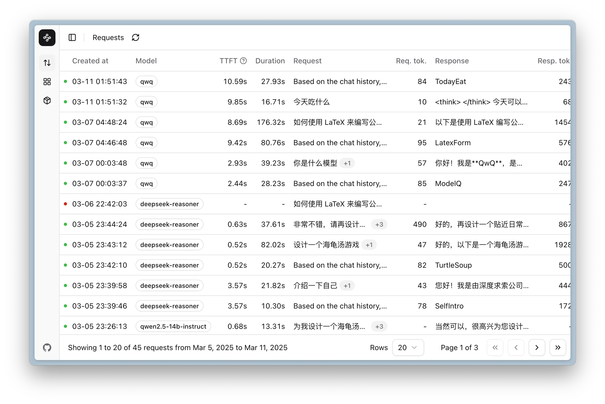
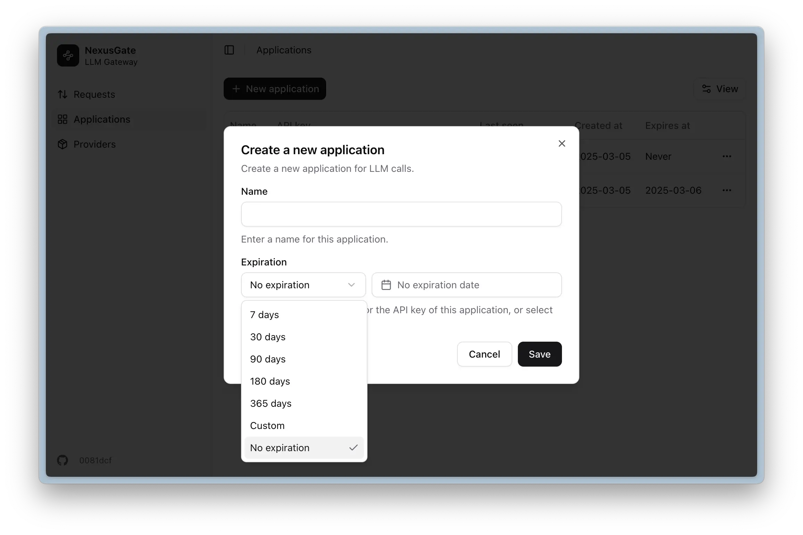

<div align="center">


# NexusGate

Monitor and manage your Agent applications with just one line of code

[](https://github.com/em-geeklab/nexusgate/blob/main/LICENSE)
[](https://github.com/em-geeklab/nexusgate/stargazers)
[](https://github.com/em-geeklab/nexusgate/issues)
[](https://img.shields.io/badge/free-pricing?logo=free&color=%20%23155EEF&label=pricing&labelColor=%20%23528bff)

</div>

<div align="right">
  <a href="README.md">中文</a>
</div>

---

## 🚀 Introduction

NexusGate is an open-source, lightweight **AI Agent and LLM application** monitoring and management tool that enables you to build a "management panel" and "task manager" for your enterprise's "intelligent infrastructure" with one click.

With the rapid development of Large Language Model (LLM) technology, intelligent Agents and AI applications built on LLMs are being widely deployed in enterprises. NexusGate provides a comprehensive platform for managing, tracking, debugging, analyzing, and optimizing these **LLM-based intelligent Agent applications**. Whether it's simple ChatBots, complex multi-step Agent workflows, or knowledge base applications integrated with RAG (Retrieval Augmented Generation), NexusGate offers a unified monitoring and management experience.

Designed for AI developers and enterprise administrators, NexusGate features an intuitive management interface and developer-friendly REST APIs, providing functionalities such as **LLM call logging**, **Agent runtime performance tracking**, **Token cost analysis**, **LLM request traffic control**, **multi-platform model unified management**, **enterprise-grade AI application governance**, and **inference service monitoring**. On NexusGate, developers can optimize Agent configurations based on detailed LLM interaction history, while enterprise administrators can use a centralized monitoring dashboard to manage all LLM-based intelligent applications within the enterprise from a single point, improving overall management and development efficiency.

## ✨ Key Features

- **Comprehensive LLM Management**: Focus on your AI applications through a unified management system to improve quality, reduce costs, decrease latency, and ensure security. Compatible with all mainstream large language model services and inference frameworks.
- **Evaluation and Iteration**: Leverage powerful tools and insights to analyze, modify, and iterate platform-integrated LLM applications.
- **Production Monitoring**: Record all production interactions for monitoring, analysis, debugging, and optimization.
- **Enterprise-Grade Management**: Manage applications or business systems with one click, providing metering and auditing of LLM content.

## 🐳 Quick Start

### Prerequisites

NexusGate uses Docker for deployment. Please ensure your system has Docker and Docker Compose installed.

#### Install Docker

If Docker is not installed on your system, please visit the [Docker official website](https://www.docker.com/) to download and install the version suitable for your operating system:

- **Windows/macOS users**: Download and install [Docker Desktop](https://www.docker.com/products/docker-desktop/)
- **Linux users**: Refer to [Docker Engine installation guide](https://docs.docker.com/engine/install/) or use the get.docker.com script for installation.

```bash
curl -fsSL https://get.docker.com | sudo sh
```

#### Verify Installation

After installation, run the following commands in terminal or CMD to verify:

```bash
docker --version
docker compose version
```

If the commands output version information normally, the installation is successful.

### One-Click Deployment

**Method 1: One-Click Script Deployment (Recommended)**

If you are using Linux or macOS, you can run the following command to quickly deploy NexusGate:

```bash
curl -fsSL https://github.com/EM-GeekLab/NexusGate/raw/refs/heads/main/scripts/quick-start.sh -o quick-start.sh
bash quick-start.sh
```

If you are using Windows, please download [quick-start.bat](https://github.com/EM-GeekLab/NexusGate/raw/refs/heads/main/scripts/quick-start.bat) and run it in CMD:

```
.\quick-start.bat
```

💡 **Interactive Configuration**: The one-click script supports interactive configuration, you can:

- **Custom Password**: Enter your own database password and admin key
- **Auto-Generate**: Press Enter directly to use secure random passwords (recommended)
- **Port Configuration**: Customize web service port (default 8080)
- **Input Validation**: The script validates password strength and port validity

🔒 **Security Features**:

- Password input is hidden in terminal
- Auto-generated passwords are 16-character strong passwords
- Supports password length validation (minimum 8 characters)
- Port range validation (1024-65535)

❗ **Note**: The script will automatically create a `.env` file, please do not delete this file.

**Method 2: Manual Configuration**

1. **Download Configuration File**

   ```bash
   wget https://github.com/EM-GeekLab/NexusGate/raw/refs/heads/main/docker-compose.yaml
   ```

2. **Configure Environment Variables (Important)**

   Create environment variable configuration file:

   ```bash
   cat > .env << 'EOF'
   # ======================
   # Database Configuration
   # ======================
   # PostgreSQL database password (must change)
   POSTGRES_PASSWORD=your_secure_database_password_here

   # ======================
   # Admin Configuration
   # ======================
   # Admin key for accessing admin interface (must change)
   ADMIN_SUPER_SECRET=your_admin_secret_key_here

   # ======================
   # Service Configuration
   # ======================
   # Web service external port (optional, default 8080)
   WEB_PORT=8080
   EOF
   ```

   **Important Parameter Description:**

   | Parameter            | Required | Description                                  | Example Value           |
   | -------------------- | -------- | -------------------------------------------- | ----------------------- |
   | `POSTGRES_PASSWORD`  | ✅       | Database password, recommend strong password | `MySecurePass123!`      |
   | `ADMIN_SUPER_SECRET` | ✅       | Admin login key                              | `admin_key_2024_secure` |
   | `WEB_PORT`           | ❌       | Web service port                             | `8080`                  |

   > ⚠️ **Security Warning**:
   >
   > - Please make sure to change `POSTGRES_PASSWORD` and `ADMIN_SUPER_SECRET`!
   > - Passwords should include uppercase and lowercase letters, numbers, and special characters
   > - Length should be at least 12 characters
   > - Use more complex passwords in production environment

3. **Start Services**

   ```bash
   docker compose up -d
   ```

4. **Access System**

   After startup, access in browser: `http://localhost:8080` (if you changed the port, use the corresponding port).

   Use the `ADMIN_SUPER_SECRET` set in your `.env` file as the admin key to login. After login, please refresh the page to ensure configuration takes effect.

### Troubleshooting

**Common Issue Solutions:**

1. **Port Conflict**

   ```bash
   # Modify port in .env file
   WEB_PORT=9090  # Change to another port
   ```

2. **Permission Issues (Linux/macOS)**

   ```bash
   # Ensure current user is in docker group
   sudo usermod -aG docker $USER
   newgrp docker
   ```

3. **Service Status Check**

   ```bash
   # View all service status
   docker compose ps

   # View service logs
   docker compose logs -f

   # Restart services
   docker compose restart
   ```

4. **Complete Reset**

   ```bash
   # Stop and remove all containers and data
   docker compose down -v

   # Restart
   docker compose up -d
   ```

**Get Help:**

- If you encounter problems, please check [GitHub Issues](https://github.com/EM-GeekLab/NexusGate/issues)
- Or submit a new Issue in the project repository

## 🔍 System Features

### 1. Model Layer Management

Connect and manage multiple LLM services,such as:

- Public Cloud Services: OpenAI, DeepSeek, Alibaba Qwen
- Enterprise Private Models: Large Model All-in-One Machine

NexusGate supports over 20 tested model services and deployment frameworks, while supporting multiple integrable client applications, giving you flexibility and choice.

_Figure 1.1: Creating Model Layer Configuration_

> _You can also view the example below for more details._

<details>
 <summary><mark>Click to view example video:Configure a Model</mark></summary>
 <video controls src="https://github.com/user-attachments/assets/7c3aec03-c288-494d-a08c-aec5c92c509a" title="Configure a Model"></video>
</details>

### 2. Comprehensive Logging

Monitor detailed information of all interactions, including:

- Request timestamps and status.
- Input prompts and generated content.
- Model information and token usage.
- Latency metrics and user feedback.

The system provides an admin view of all API key chat logs and history records for specific API keys, with a detailed sidebar view of request details and conversation context.


_Figure 2.1: Conversation Details Sidebar_


_Figure 2.2: Historical Display_

### 3. Application Management

Control and configure platform-integrated applications:

- API key creation and management.
- user-friendly naming conventions.
- expiration settings and visibility controls.


_Figure 3.1: Application with API Key Settings_

> _You can also view the example below for more details._

<details>
 <summary><mark>Click to view example video:Create and Manage Application</mark></summary>

<video controls src="https://github.com/user-attachments/assets/a8a2f0a9-f4c0-43b9-a604-29167c439386" title="Create and Manage API Keys"></video>

 </details>

## 👨‍💻 For Developers

### 1.One-Line Code Integration

Integrate NexusGate into your existing LLM applications with just one line of code modification:

#### Python (Using OpenAI library)

```python
# Before:
from openai import OpenAI
client = OpenAI(api_key="your-openai-api-key")

# After:
from openai import OpenAI
client = OpenAI(api_key="your-nexusgate-api-key", base_url="https://your-nexusgate-server/v1")
```

#### JavaScript/TypeScript

```javascript
// Before:
import OpenAI from "openai";
const openai = new OpenAI({ apiKey: "your-openai-api-key" });

// After:
import OpenAI from "openai";
const openai = new OpenAI({
  apiKey: "your-nexusgate-api-key",
  baseURL: "https://your-nexusgate-server/v1",
});
```

### 2.API Documentation

NexusGate provides comprehensive OpenAPI documentation for easy integration with your existing systems and workflows. You can access the OpenAPI specification at:

```
https://your-nexusgate-server/swagger
```

The documentation includes all available endpoints, request/response formats, and authentication requirements, enabling developers to quickly understand and utilize all of NexusGate's capabilities.

## 👨‍💼 For Administrators

### 1.Centralized LLM Management

NexusGate provides a unified dashboard for managing all LLM applications in your organization:

- **Cost Control**: Track token usage across all applications and providers
- **Security Oversight**: Monitor all prompts and completions to ensure compliance and data protection
- **Performance Optimization**: Identify bottlenecks and optimize response times
- **Usage Analytics**: Understand how different teams and applications are utilizing LLM resources

### 2.Application Management

Manage platform-integrated applications,offering flexible expiration settings for enhanced security, rate limits and usage limits for cost control, and granular permissions for different models and features.

## 🗺️ Roadmap

We're constantly adding new features and capabilities to NexusGate. Here's what we're working on next:

- [x] 🌐 Internationalization: Complete i18n support with official Chinese language support.
- [ ] 📊 Enhanced Analytics: Expand our monitoring metrics including success rates, request volumes, token usage statistics, request completion rates, Agent usage rankings, model usage rankings, error analysis, full-chain latency, inference latency, and throughput measurements.
- [x] 🔄 Prometheus Integration: Create comprehensive overview dashboards by integrating with external Prometheus instances to monitor server hardware, inference frameworks, and other information sources.
- [x] 🚦 Traffic Control: Implement fine-grained traffic management for each API key, including quotas and priorities for specific models, enabling administrators to precisely control resource allocation.
- [ ] 💡 Manual Reporting SDK: Develop SDKs for more granular tracking that can be embedded directly in developer code, enabling more detailed monitoring such as end-user analytics.
- [ ] 👍 Feedback System: Build robust feedback mechanisms to collect and analyze user responses to AI-generated content.
- [ ] 💬 Prompt Management: Create tools for prompt creation, optimization, and batch testing, helping developers craft more effective interactions with LLMs.
  - [ ] 🧠 Automated Evaluation: Leverage LLMs to automatically evaluate outputs and provide quality metrics without human intervention.
  - [ ] 📚 Dataset Creation and Fine-tuning: Implement dataset management and model fine-tuning pipelines, one-click import to [LLaMa Factory](https://github.com/hiyouga/LLaMA-Factory) for fine-tuning, and monitoring using [SwanLab](https://github.com/SwanHubX/SwanLab).
- [ ] 🛠️ Tool Integration: Add capabilities to models without built-in tools (like web search) by implementing functionality at the gateway layer and exposing it through standard API interfaces.

## 📝 License

[Apache License 2.0](LICENSE)

## 🤝 Contributing

We welcome developers of all skill levels to contribute! Whether it's fixing bugs, adding features, or improving documentation, your contributions are valuable.

Please check out [CONTRIBUTING.md](CONTRIBUTING.md) to learn how to get started.

**Contributors**


## 📚 Documentation

For more detailed information, visit our [official documentation](https://geektechstudio.feishu.cn/wiki/RNWDwS8NyiZZdokTV4IcmXm5nBg).
