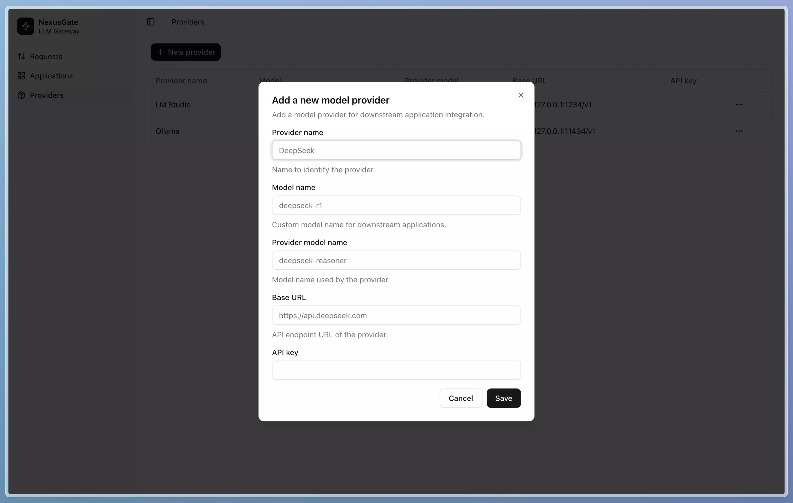
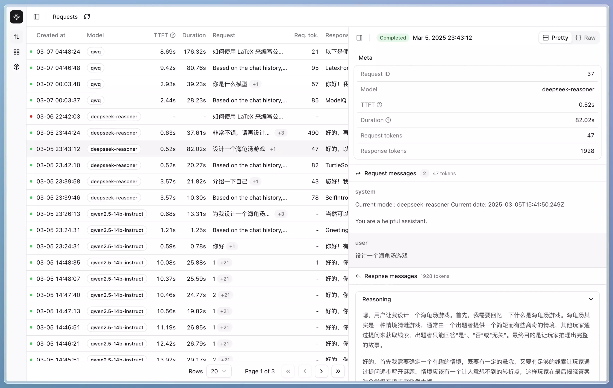
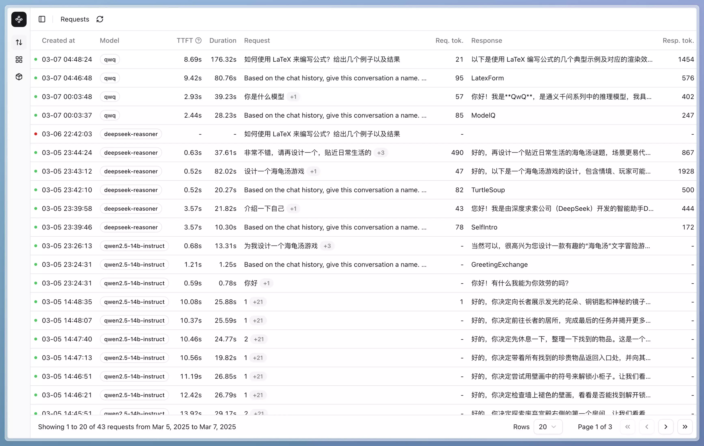
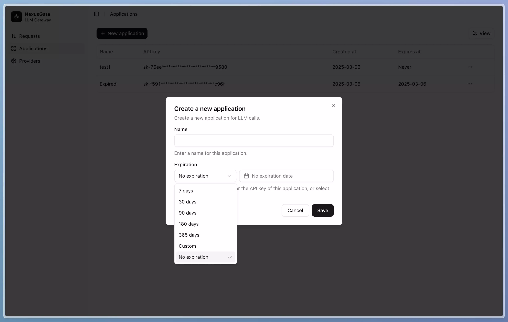

<div align="center">

<h1>NexusGate</h1>
仅需一行代码，完成 Agent 应用的监控与管理

[](https://github.com/geektechx/nexusgate/blob/main/LICENSE)
[](https://github.com/geektechx/nexusgate/stargazers)
[](https://github.com/geektechx/nexusgate/issues)
[](https://img.shields.io/badge/free-pricing?logo=free&color=%20%23155EEF&label=pricing&labelColor=%20%23528bff)
</div>

<div align="right">
  <a href="README.en.md">English</a>
</div>

- [🚀 简介](#-简介)
- [🌟 主要特点](#-主要特点)
- [🚀 快速启动](#-快速启动)
- [🔍 系统功能](#-系统功能)
- [👨‍💻 面向开发者](#-面向开发者)
- [👨‍💼 面向管理员](#-面向管理员)
- [🗺️ 发展路线图](#%EF%B8%8F-发展路线图)
- [📝 许可证](#-许可证)
- [🤝 贡献](#-贡献)
- [📚 文档](#-文档)

---

## 🚀 简介

NexusGate 是一个 Agent 应用监控和管理平台。它将帮助 Agent 应用了解用户反馈情况而无需额外开发，加速 Agent 优化迭代的生命周期。

使用 NexusGate，您只需修改一行代码即可监控、管理和优化您的 Agent 应用。它还能帮助企业通过开箱即用、一键设置建立内部智能基座。

## ✨ 主要特点

- **全面的 LLM 管理**：通过统一管理系统专注于您的 AI 应用，提高质量、降低成本、减少延迟并确保安全。兼容所有主流大型语言模型服务和推理框架。

- **评估和迭代**：利用强大的工具和洞察分析、修改和迭代平台接入的LLM 应用。

- **生产监控**：记录所有生产交互以进行监控、分析、调试、优化。

- **企业级管理**：一键管理通过 NexusGate 接入的应用程序，提供 LLM 内容的计量和审计。

## 🐳 快速启动

NexusGate 提供 Docker Compose 配置文件，支持 ARM 和 x86 架构。

```bash
wget https://github.com/GeekTechX/NexusGate/raw/refs/heads/main/docker-compose.yaml
nano docker-compose.yaml # 或者使用其他文本编辑器
docker compose up -d
```

## 🔍 系统功能

### 1. 模型层管理
 
对接和管理不同大型语言模型（LLM）服务商，例如：
- 公共云服务：OpenAI、DeepSeek、阿里千问
- 企业私有模型：大模型一体机

NexusGate 支持 20 多个经过测试的模型服务和部署框架，同时支持多个可接入的客户端应用，为您提供灵活性和选择。

*图1-1 创建模型层配置*


>*您也可以通过查看下方的示例来详细了解*

<details>
<summary><mark>点击展开示例视频：如何配置模型</mark></summary>
<video controls src="https://private-user-images.githubusercontent.com/20714618/423244526-7c3aec03-c288-494d-a08c-aec5c92c509a.mp4?jwt=eyJhbGciOiJIUzI1NiIsInR5cCI6IkpXVCJ9.eyJpc3MiOiJnaXRodWIuY29tIiwiYXVkIjoicmF3LmdpdGh1YnVzZXJjb250ZW50LmNvbSIsImtleSI6ImtleTUiLCJleHAiOjE3NDIyMDAyOTgsIm5iZiI6MTc0MjE5OTk5OCwicGF0aCI6Ii8yMDcxNDYxOC80MjMyNDQ1MjYtN2MzYWVjMDMtYzI4OC00OTRkLWEwOGMtYWVjNWM5MmM1MDlhLm1wND9YLUFtei1BbGdvcml0aG09QVdTNC1ITUFDLVNIQTI1NiZYLUFtei1DcmVkZW50aWFsPUFLSUFWQ09EWUxTQTUzUFFLNFpBJTJGMjAyNTAzMTclMkZ1cy1lYXN0LTElMkZzMyUyRmF3czRfcmVxdWVzdCZYLUFtei1EYXRlPTIwMjUwMzE3VDA4MjYzOFomWC1BbXotRXhwaXJlcz0zMDAmWC1BbXotU2lnbmF0dXJlPTIzMjg0YTY1ODFkODI3Y2JhZDZmMGQ2ZDUzYWM4NTlmNTExZDA1OTgzOTk1ODlmNjMwYTRhZjhiNmM5NzEwMGEmWC1BbXotU2lnbmVkSGVhZGVycz1ob3N0In0.OZxdZhFUnK8cylHu2de_gLXQmiyNzDGJw42mWD7b4N4" title="模型配置示例"></video>
</details>


### 2. 全面日志记录

监控所有交互的详细信息，包括记录每次请求的完整信息，包括：

- 时间戳与请求状态。

- 输入提示与生成内容。

- 模型信息与 Token 用量。

- 延迟指标与用户反馈


系统提供所有 API 密钥聊天记录的管理员视图和特定 API 密钥的历史记录，并带有请求细节和对话上下文的详细侧边栏视图。


*图2-1 对话详情侧边栏*  



*图2-2 历史记录显示*  


### 3. 应用管理
调控和配置平台接入应用：
- API 密钥创建和管理
- 用户友好的命名约定
- 过期设置和可见性控制


*图3-1 API 密钥应用设置*

>*您也可以通过查看下方的示例来详细了解*

<details>
<summary><mark>点击展开示例视频：如何创建和管理API密钥</mark></summary>

<video controls src="https://private-user-images.githubusercontent.com/20714618/423244530-a8a2f0a9-f4c0-43b9-a604-29167c439386.mp4?jwt=eyJhbGciOiJIUzI1NiIsInR5cCI6IkpXVCJ9.eyJpc3MiOiJnaXRodWIuY29tIiwiYXVkIjoicmF3LmdpdGh1YnVzZXJjb250ZW50LmNvbSIsImtleSI6ImtleTUiLCJleHAiOjE3NDIyMDA5MDcsIm5iZiI6MTc0MjIwMDYwNywicGF0aCI6Ii8yMDcxNDYxOC80MjMyNDQ1MzAtYThhMmYwYTktZjRjMC00M2I5LWE2MDQtMjkxNjdjNDM5Mzg2Lm1wND9YLUFtei1BbGdvcml0aG09QVdTNC1ITUFDLVNIQTI1NiZYLUFtei1DcmVkZW50aWFsPUFLSUFWQ09EWUxTQTUzUFFLNFpBJTJGMjAyNTAzMTclMkZ1cy1lYXN0LTElMkZzMyUyRmF3czRfcmVxdWVzdCZYLUFtei1EYXRlPTIwMjUwMzE3VDA4MzY0N1omWC1BbXotRXhwaXJlcz0zMDAmWC1BbXotU2lnbmF0dXJlPTc1OGVhOTJkYjc0YWFhZmRkNzFiMzAxMmRlMDg3ZjhjNzQ2YTk0MjA2ZGVmMjI2NWI3YjFmNjM3ZWZjZDU1ODYmWC1BbXotU2lnbmVkSGVhZGVycz1ob3N0In0.L48lR7l7F4-o0BMlEb5DHp72X0kcu1-cwGCJf0U5mAY" title="API创建与管理示例"></video>
</details>

## 👨‍💻 面向开发者

### 1. 一行代码集成

只需修改一行代码即可将 NexusGate 集成到您现有的 LLM 应用中：

#### Python (使用 OpenAI 库)

```python
# 修改前:
from openai import OpenAI
client = OpenAI(api_key="your-openai-api-key")

# 修改后:
from openai import OpenAI
client = OpenAI(api_key="your-nexusgate-api-key", base_url="https://your-nexusgate-server/v1")
```

#### JavaScript/TypeScript

```javascript
// 修改前:
import OpenAI from 'openai';
const openai = new OpenAI({ apiKey: 'your-openai-api-key' });

// 修改后:
import OpenAI from 'openai';
const openai = new OpenAI({ 
  apiKey: 'your-nexusgate-api-key',
  baseURL: 'https://your-nexusgate-server/v1'
});
```

### 2. API 文档

NexusGate 提供全面的 OpenAPI 文档，便于与您现有的系统和工作流程集成。可以通过以下地址访问 OpenAPI 规范：

```
https://your-nexusgate-server/swagger
```

该文档包括所有可用端点、请求/响应格式和身份验证要求，使开发者能够快速理解并利用 NexusGate 的全部功能。

## 👨‍💼 面向管理员

### 1. 集中式 LLM 管理

NexusGate 为管理组织所有 LLM 应用提供统一仪表板：

- **成本控制**：跟踪所有应用和提供商的 Token 使用情况
- **安全监督**：监控所有提示和完成内容，确保合规和数据保护
- **性能优化**：识别瓶颈并优化响应时间
- **使用分析**：了解不同团队和应用如何利用 LLM 资源

### 2. 应用管理

控制和配置平台接入的应用，提供增强安全性的灵活过期设置、控制成本的速率限制和使用限制，以及针对不同模型和功能的精细权限设置。

## 🗺️ 发展路线图

我们不断为 NexusGate 添加新功能和能力。以下是我们接下来的工作计划：

- [ ] 🌐 国际化：完成 i18n 支持，提供官方中文支持。
- [ ] 📊 增强分析：扩展我们的监控指标，包括成功率、请求量、Token 使用统计、请求完成率、Agent 使用量排行、模型使用量排行、错误分析、全链路延迟、推理延迟和吞吐量等测量。
- [ ] 🔄 Prometheus 集成：通过与外部 Prometheus 实例集成，监控服务器硬件、推理框架和其他信息源，创建全面的概览仪表板。
- [ ] 🚦 流量控制 ：为每个 API 密钥实现精细的流量管理，包括特定模型的配额和优先级，使管理员能够精确控制资源分配。
- [ ] 💡 手动上报 SDK：开发用于更精细跟踪的 SDK，可直接嵌入开发者代码，实现更详细的监控，如终端用户分析。
- [ ] 👍 反馈系统：构建强大的反馈机制，收集和分析用户对 AI 生成内容的响应。
- [ ] 💬 提示词管理：创建用于提示词创建、优化和批量测试的工具，帮助开发者制作与 LLM 更有效的交互。
- [ ] 🧠 自动化评估：利用 LLM 自动评估输出并提供质量指标，无需人工干预。
- [ ] 📚 数据集创建和微调：实现数据集管理和模型微调流水线，一键导入 [LLaMa Factory](https://github.com/hiyouga/LLaMA-Factory) 微调，并使用 [SwanLab](https://github.com/SwanHubX/SwanLab) 监控。
- [ ] 🛠️ 工具集成：通过在网关层实现功能并通过标准 API 接口暴露，为没有内置工具（如网络搜索）的模型添加功能。

## 📝 许可证

[Apache License 2.0](LICENSE)

## 🤝 贡献

我们欢迎各种技能水平的开发者贡献！无论是修复错误、添加功能还是改进文档，您的投入都很有价值。

>请查看 [CONTRIBUTING.md](CONTRIBUTING.md) 了解如何开始。  

**Contributors**


## 📚 文档

有关更详细的信息，请访问我们的[官方文档](https://docs.nexusgate.io)。
