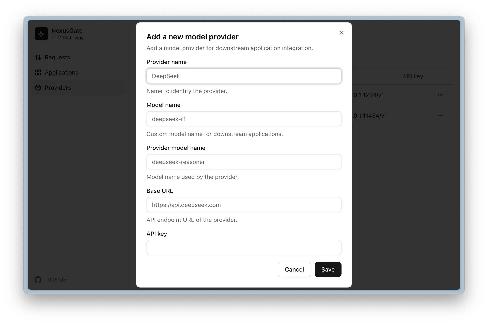
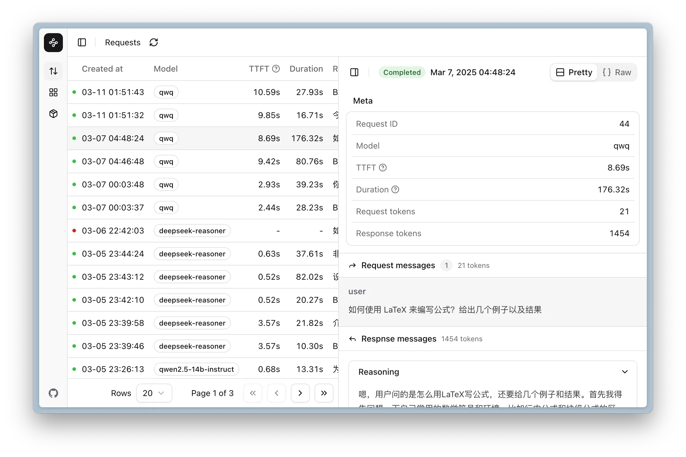

<div align="center">


# NexusGate

仅需一行代码，完成 Agent 应用的监控与管理

[](https://github.com/em-geeklab/nexusgate/blob/main/LICENSE)
[](https://github.com/em-geeklab/nexusgate/stargazers)
[](https://github.com/em-geeklab/nexusgate/issues)
[](https://img.shields.io/badge/free-pricing?logo=free&color=%20%23155EEF&label=pricing&labelColor=%20%23528bff)

</div>

<div align="right">
  <a href="README.en.md">English</a>
</div>

---

## 🚀 简介

NexusGate 是一个 Agent 应用监控和管理平台。它将帮助 Agent 应用了解用户反馈情况而无需额外开发，加速 Agent 优化迭代的生命周期。

使用 NexusGate，您只需修改一行代码即可监控、管理和优化您的 Agent 应用。它还能帮助企业通过开箱即用、一键设置建立内部智能基座。

## ✨ 主要特点

- **全面的 LLM 管理**：通过统一管理系统专注于您的 AI 应用，提高质量、降低成本、减少延迟并确保安全。兼容所有主流大型语言模型服务和推理框架。
- **评估和迭代**：利用强大的工具和洞察分析、修改和迭代平台接入的LLM 应用。
- **生产监控**：记录所有生产交互以进行监控、分析、调试、优化。
- **企业级管理**：一键管理应用程序或业务系统，提供 LLM 内容的计量和审计。

## 🐳 快速启动

### 前置要求

NexusGate 使用 Docker 进行部署，请确保您的系统已安装 Docker 和 Docker Compose。

#### 安装 Docker

如果您的系统尚未安装 Docker，请访问 [Docker 官方网站](https://www.docker.com/) 下载并安装适合您操作系统的版本：

- **Windows/macOS 用户**：下载并安装 [Docker Desktop](https://www.docker.com/products/docker-desktop/)
- **Linux 用户**：参考 [Docker Engine 安装指南](https://docs.docker.com/engine/install/) 或使用 get.docker.com 脚本进行安装。

```bash
curl -fsSL https://get.docker.com | sudo sh
```

#### 验证安装

安装完成后，请在终端或 CMD 中运行以下命令验证：

```bash
docker --version
docker compose version
```

如果命令正常输出版本信息，说明安装成功。

### 一键部署

#### **方式一：一键脚本部署（推荐）**

如果您使用的是 Linux 或 macOS，可以直接运行以下命令来快速部署 NexusGate：

```bash
curl -fsSL https://github.com/EM-GeekLab/NexusGate/raw/refs/heads/main/scripts/quick-start.sh | bash
```

如果您使用的是 Windows，请下载 [quick-start.bat](https://github.com/EM-GeekLab/NexusGate/raw/refs/heads/main/scripts/quick-start.bat) 并在 CMD 中运行：

```
.\quick-start.bat
```

💡 **交互式配置**：一键脚本支持交互式配置，您可以：

- **自定义密码**：输入您自己的数据库密码和管理员密钥
- **自动生成**：直接回车使用安全的随机密码（推荐）
- **端口配置**：自定义 Web 服务端口（默认 8080）
- **输入验证**：脚本会验证密码强度和端口有效性

🔒 **安全特性**：

- 密码输入不会在终端显示
- 自动生成的密码为 16 位强密码
- 支持密码长度验证（最少 8 位）
- 端口范围验证（1024-65535）
  💡 **注意**：脚本会自动创建 `.env` 文件，请勿删除该文件。

**方式二：手动配置**

1. **下载配置文件**
   ```bash
   wget https://github.com/EM-GeekLab/NexusGate/raw/refs/heads/main/docker-compose.yaml
   ```
2. **配置环境变量（重要）**
   创建环境变量配置文件：

   ```bash
   cat > .env << 'EOF'
   # ======================
   # 数据库配置
   # ======================
   # PostgreSQL 数据库密码（必需修改）
   POSTGRES_PASSWORD=your_secure_database_password_here

   # ======================
   # 管理员配置
   # ======================
   # 管理员密钥，用于访问管理界面（必需修改）
   ADMIN_SUPER_SECRET=your_admin_secret_key_here

   # ======================
   # 服务配置
   # ======================
   # Web 服务对外端口（可选，默认 8080）
   WEB_PORT=8080
   EOF
   ```

   **重要参数说明：**
   | 参数名 | 必需 | 说明 | 示例值 |
   | -------------------- | ---- | -------------------------- | ----------------------- |
   | `POSTGRES_PASSWORD` | ✅ | 数据库密码，建议使用强密码 | `MySecurePass123!` |
   | `ADMIN_SUPER_SECRET` | ✅ | 管理员登录密钥 | `admin_key_2024_secure` |
   | `WEB_PORT` | ❌ | Web 服务端口 | `8080` |

   > ⚠️ **安全提示**：
   >
   > - 请务必修改 `POSTGRES_PASSWORD` 和 `ADMIN_SUPER_SECRET`！
   > - 密码建议包含大小写字母、数字和特殊字符
   > - 长度至少 12 位以上
   > - 生产环境请使用更复杂的密码

3. **启动服务**

   ```bash
   docker compose up -d
   ```

4. **访问系统**

   启动完成后，在浏览器中访问：`http://localhost:8080`（如果您修改了端口，请使用相应端口）。

   使用您在 `.env` 文件中设置的 `ADMIN_SUPER_SECRET` 作为管理员密钥登录。登录后，请刷新页面以确保配置生效。

### 故障排除

**常见问题解决：**

1. **端口冲突**

   ```bash
   # 修改 .env 文件中的端口
   WEB_PORT=9090  # 改为其他端口
   ```

2. **权限问题（Linux/macOS）**

   ```bash
   # 确保当前用户在 docker 组中
   sudo usermod -aG docker $USER
   newgrp docker
   ```

3. **服务状态检查**

   ```bash
   # 查看所有服务状态
   docker compose ps

   # 查看服务日志
   docker compose logs -f

   # 重启服务
   docker compose restart
   ```

4. **完全重置**

   ```bash
   # 停止并删除所有容器和数据
   docker compose down -v

   # 重新启动
   docker compose up -d
   ```

**获取帮助：**

- 如果遇到问题，请查看 [GitHub Issues](https://github.com/EM-GeekLab/NexusGate/issues)
- 或者在项目仓库提交新的 Issue

## 🔍 系统功能

### 1. 模型层管理

对接和管理不同大型语言模型（LLM）服务，例如：

- 公共云服务：OpenAI、DeepSeek、阿里千问
- 企业私有模型：大模型一体机

NexusGate 支持 20 多个经过测试的模型服务和部署框架，同时支持多个可接入的客户端应用，为您提供灵活性和选择。


_图1-1 创建模型层配置_

> _您也可以通过查看下方的示例来详细了解_

<details>
<summary><mark>点击展开示例视频：如何配置模型</mark></summary>
<video controls src="https://github.com/user-attachments/assets/7c3aec03-c288-494d-a08c-aec5c92c509a"></video>
</details>

### 2. 全面日志记录

监控所有交互的详细信息，包括记录每次请求的完整信息，包括：

- 时间戳与请求状态。
- 输入提示与生成内容。
- 模型信息与 Token 用量。
- 延迟指标与用户反馈

系统提供所有 API 密钥聊天记录的管理员视图和特定 API 密钥的历史记录，并带有请求细节和对话上下文的详细侧边栏视图。


_图2-1 对话详情侧边栏_


_图2-2 历史记录显示_

### 3. 应用管理

调控和配置平台接入应用：

- API 密钥创建和管理
- 用户友好的命名约定
- 过期设置和可见性控制


_图3-1 API 密钥应用设置_

> _您也可以通过查看下方的示例来详细了解_

<details>
<summary><mark>点击展开示例视频：如何创建和管理API密钥</mark></summary>

<video controls src="https://github.com/user-attachments/assets/a8a2f0a9-f4c0-43b9-a604-29167c439386" title="API创建与管理示例"></video>

</details>

## 👨‍💻 面向开发者

### 1. 一行代码集成

只需修改一行代码即可将 NexusGate 集成到您现有的 LLM 应用中：

#### Python (使用 OpenAI 库)

```python
# 修改前:
from openai import OpenAI
client = OpenAI(api_key="your-openai-api-key")

# 修改后:
from openai import OpenAI
client = OpenAI(api_key="your-nexusgate-api-key", base_url="https://your-nexusgate-server/v1")
```

#### JavaScript/TypeScript

```javascript
// 修改前:
import OpenAI from "openai";
const openai = new OpenAI({ apiKey: "your-openai-api-key" });

// 修改后:
import OpenAI from "openai";
const openai = new OpenAI({
  apiKey: "your-nexusgate-api-key",
  baseURL: "https://your-nexusgate-server/v1",
});
```

### 2. API 文档

NexusGate 提供全面的 OpenAPI 文档，便于与您现有的系统和工作流程集成。可以通过以下地址访问 OpenAPI 规范：

```
https://your-nexusgate-server/swagger
```

该文档包括所有可用端点、请求/响应格式和身份验证要求，使开发者能够快速理解并利用 NexusGate 的全部功能。

## 👨‍💼 面向管理员

### 1. 集中式 LLM 管理

NexusGate 为管理组织所有 LLM 应用提供统一仪表板：

- **成本控制**：跟踪所有应用和提供商的 Token 使用情况
- **安全监督**：监控所有提示和完成内容，确保合规和数据保护
- **性能优化**：识别瓶颈并优化响应时间
- **使用分析**：了解不同团队和应用如何利用 LLM 资源

### 2. 应用管理

管理平台接入的应用，提供增强安全性的灵活过期设置、控制成本的速率限制和使用限制，以及针对不同模型和功能的精细权限设置。

## 🗺️ 发展路线图

我们不断为 NexusGate 添加新功能和能力。以下是我们接下来的工作计划：

- [*] 🌐 国际化：完成 i18n 支持，提供官方中文支持。
- [ ] 📊 增强分析：扩展我们的监控指标，包括成功率、请求量、Token 使用统计、请求完成率、Agent 使用量排行、模型使用量排行、错误分析、全链路延迟、推理延迟和吞吐量等测量。
- [*] 🔄 Prometheus 集成：通过与外部 Prometheus 实例集成，监控服务器硬件、推理框架和其他信息源，创建全面的概览仪表板。
- [*] 🚦 流量控制 ：为每个 API 密钥实现精细的流量管理，包括特定模型的配额和优先级，使管理员能够精确控制资源分配。
- [ ] 💡 手动上报 SDK：开发用于更精细跟踪的 SDK，可直接嵌入开发者代码，实现更详细的监控，如终端用户分析。
- [ ] 👍 反馈系统：构建强大的反馈机制，收集和分析用户对 AI 生成内容的响应。
- [ ] 💬 提示词管理：创建用于提示词创建、优化和批量测试的工具，帮助开发者制作与 LLM 更有效的交互。
  - [ ] 🧠 自动化评估：利用 LLM 自动评估输出并提供质量指标，无需人工干预。
  - [ ] 📚 数据集创建和微调：实现数据集管理和模型微调流水线，一键导入 [LLaMa Factory](https://github.com/hiyouga/LLaMA-Factory) 微调，并使用 [SwanLab](https://github.com/SwanHubX/SwanLab) 监控。
- [ ] 🛠️ 工具集成：通过在网关层实现功能并通过标准 API 接口暴露，为没有内置工具（如网络搜索）的模型添加功能。

## 📝 许可证

[Apache License 2.0](LICENSE)

## 🤝 贡献

我们欢迎各种技能水平的开发者贡献！无论是修复错误、添加功能还是改进文档，您的贡献都很有价值。

请查看 [CONTRIBUTING.md](CONTRIBUTING.md) 了解如何开始。

**Contributors**


## 📚 文档

有关更详细的信息，请访问我们的[官方文档](https://docs.nexusgate.io)。
